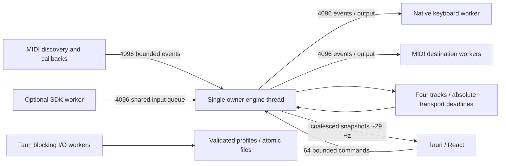

# Implemented architecture

The core has no Tauri dependency. `midi.rs` validates MIDI 1.0 channel-voice messages and normalizes Note On velocity zero. `engine.rs` routes and owns aggregate note/key/pedal state. Ownership includes source, route, original channel and pitch. Note/channel transposition is latched by the analog processor; shared physical output stays held until its last owner releases.

`runtime.rs` owns the engine, sequencer and analog processor on one thread. MIDI callbacks only parse, timestamp and try-enqueue. Overload uses an independent atomic fault flag, flushes generated-state generations, stops playback and disarms both modules. Controls reach output workers through a separate channel, so queue saturation cannot swallow cleanup. Already queued events from before route/toggle changes are rejected by a monotonic input barrier. Connection generations reject old-device callbacks.

Output workers own native handles and ledgers of successfully delivered key-downs, Note Ons and pedals. Generation changes cancel stale events and release ledgers. A Visual Pianos activation is one queued chord; its Alt velocity pulse, Ctrl/Shift prefix, key-down and immediate modifier releases execute together before the next activation. Each native step is checked for generation cancellation and failure. Output failure disarms and releases; a disappeared MIDI destination triggers fault cleanup, and available destinations reconnect on reappearance or route Apply.

The sequencer schedules absolute `Instant` deadlines rather than chaining sleep durations. Long suspension skips missed steps and releases old gates instead of bursting old notes. Pending Note Offs keep their original channel and source. Stop, track/project edits and routing changes flush affected output. Changing a project while playing preserves the running absolute transport phase; new gates use the edited tempo.

The SDK is never loaded by startup discovery. Known absolute install locations are checked with `is_file`; initialization happens only on explicit Analog enable. `libloading` resolves v0.9 symbols, checks major ABI and reported 0.9.x semver, sets HID mode, and uses fixed 256-entry sample arrays. Architecture mismatch is reported by the loader. A worker retains old libraries until exit when changing SDK paths. Disabling, read failure, or ambiguous/no devices uninitializes active SDK state. Failed or missing SDK leaves MIDI and project functionality available. The adapter is compiled out by `--no-default-features`.

Disk I/O and JSON imports/exports are outside the engine thread. UI renders snapshots, never sends event-by-event MIDI through IPC. Settings edits use a revision token and validate before writing; disk failure leaves runtime state untouched. Revision changes caused by concurrent recording can reject an edit; the user discards/reloads the draft. Project dirty state compares the saved content with the current engine content.

Known ceilings: small fixed route/track counts make linear route scans practical. This is a bounded low-latency desktop design, not hard realtime: allocations for event actions, OS MIDI calls, native event injection, and desktop scheduling remain measurable. More complicated routing graphs, plugin hosts and external clock are deliberately absent. Performance targets require native hardware tests.
